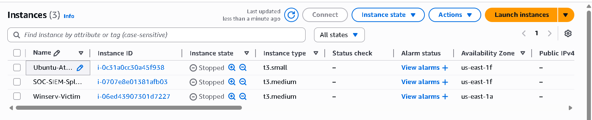
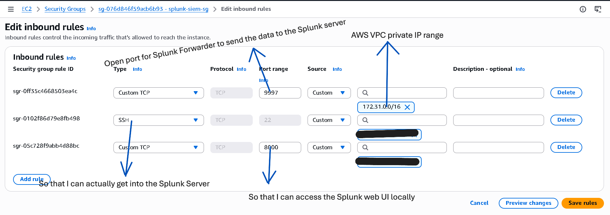
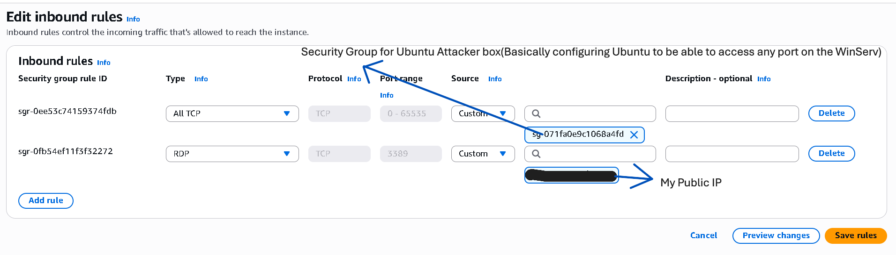
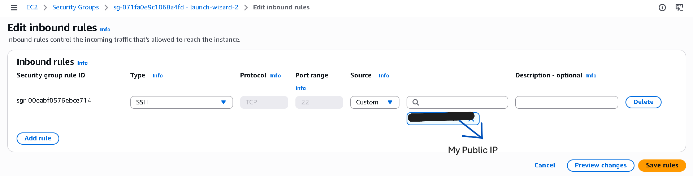

# AWS Security Groups

This section documents the network access controls configured for the SOC lab environment.

---

## AWS Instances

## Splunk SIEM Security Group

This security group allows ingestion of logs and access to the Splunk interface.

- Port 9997 – Receives logs from forwarders
- Port 8000 – Splunk web interface
- Port 22 – SSH access (restricted to administrator IP)

---

## Windows Server Security Group

The Windows server acts as the monitored endpoint generating security logs.

- Port 3389 – RDP access (restricted to administrator IP)
- Internal traffic allowed from attacker machine

---

## Ubuntu Attacker Security Group

The Ubuntu machine is used to simulate attacker activity.

- All TCP ports allowed within the VPC
- Used to generate attack traffic against the Windows server
