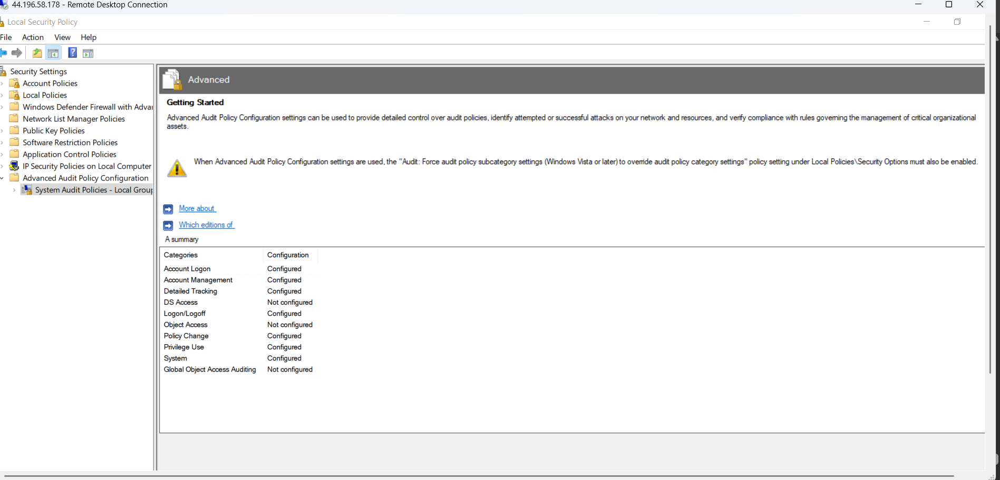

# Host Configuration

This section documents the configuration of the Windows Server used in the SOC lab. It includes logging, monitoring, and endpoint instrumentation using Sysmon and Splunk Universal Forwarder.

---

## 1. Windows Event Logging Configuration

Windows Security Event Logs were enabled and configured to capture critical events such as:

- Successful logons (Event ID 4624)
- Failed logons (Event ID 4625)
- Process creation (Event ID 4688)

### Successful Logon Event (4624)

This event confirms that user authentication activity is being logged correctly.

---

### Process Creation Event (4688)

Process creation logging allows visibility into executed binaries, which is critical for detecting malicious activity.

---

## 2. Audit Policy Configuration

Advanced audit policies were configured to ensure detailed logging across multiple categories.

### Key Enabled Categories:
- Account Logon
- Account Management
- Detailed Tracking
- Logon/Logoff
- Privilege Use
- Policy Change
- System

These settings ensure comprehensive visibility into user activity and system changes.

---

## 3. Sysmon Installation and Logging

Sysmon was installed to enhance endpoint visibility beyond default Windows logging.

Sysmon provides:
- Process creation with command-line arguments
- Network connections
- File creation and modification tracking

This significantly improves detection capabilities within the SOC.

---

## 4. Splunk Universal Forwarder Configuration

The Splunk Universal Forwarder was installed on the Windows Server to send logs to the Splunk SIEM.

### Forwarder Service Running

The service is configured to:
- Start automatically
- Forward logs to the Splunk server
- Ensure continuous log ingestion

---

### Splunk Receiving Port Configuration

Port **9997** is configured on the Splunk server to receive incoming logs from forwarders.

---

## 5. Software Installation

The following tools were downloaded and installed on the system:

- Sysmon (Microsoft Sysinternals)
- Splunk Universal Forwarder

These tools form the core of endpoint monitoring and log forwarding.

---

## Summary

This host configuration ensures:

- Centralized log collection via Splunk
- Enhanced endpoint visibility via Sysmon
- Detection capability for authentication and process activity
- A strong foundation for SOC monitoring and attack simulation

