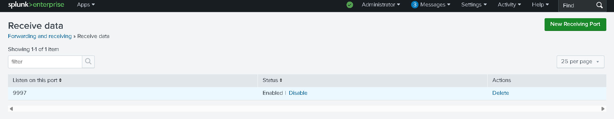

# Security Information and Event Management (SIEM)

This section demonstrates the implementation of Splunk as a centralized SIEM for log collection, detection engineering, and security monitoring within the AWS SOC Lab.

---

## Overview

The SIEM environment consists of:

- Splunk Enterprise running on Ubuntu (SIEM server)
- Windows Server forwarding logs via Splunk Universal Forwarder
- Sysmon providing enhanced endpoint telemetry
- Custom dashboards and SPL queries for detection

---

## 1. Log Ingestion Configuration

Splunk was configured to receive logs on port 9997 from the Windows Server using the Universal Forwarder.

This confirms:
- Forwarder → SIEM communication is working
- Logs are successfully being ingested into Splunk

